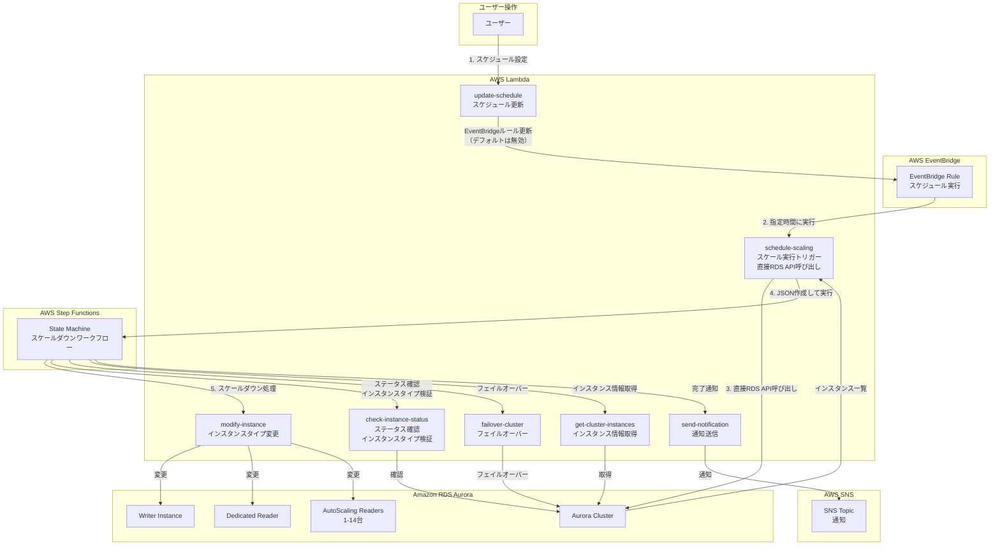
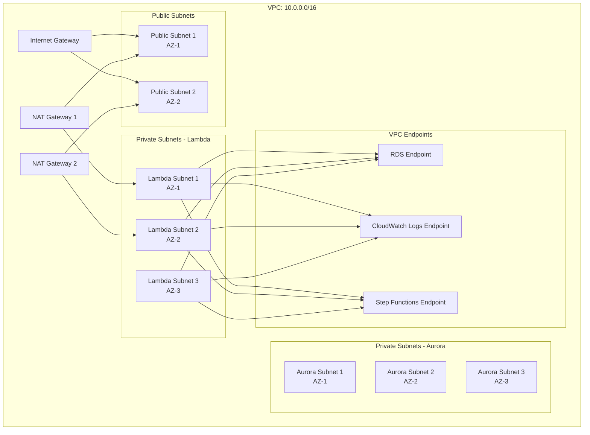
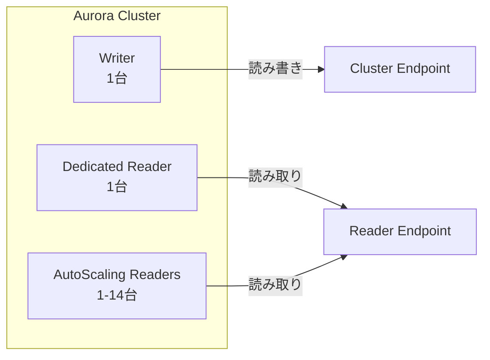
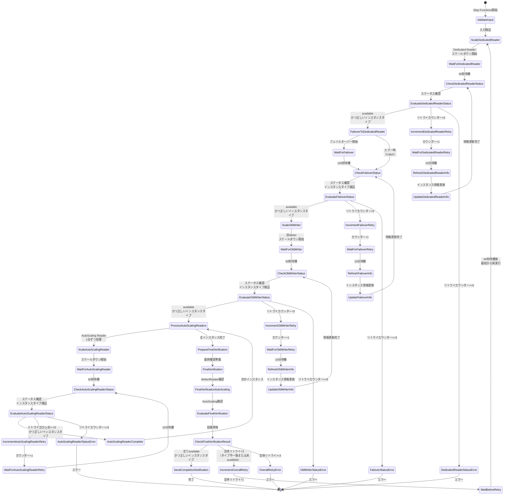
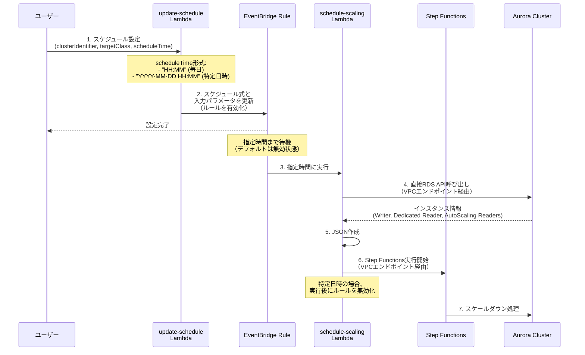
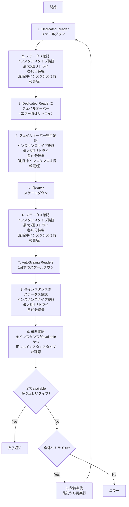
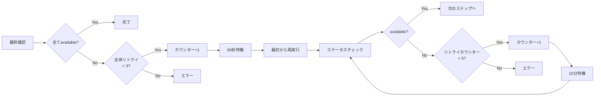
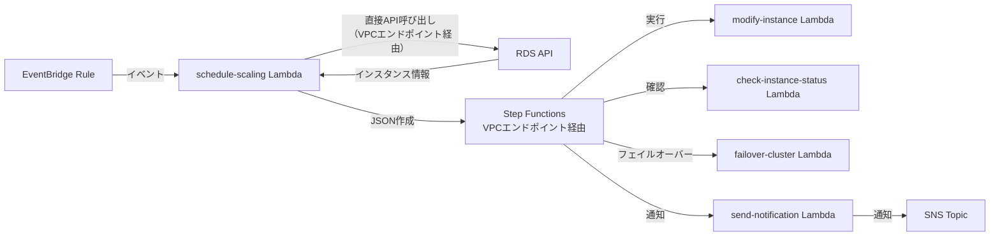

# Aurora スケールダウン自動化システム アーキテクチャ

## 概要

Aurora PostgreSQLクラスターのインスタンスタイプを自動的にスケールダウンするシステムです。

### 主な特徴

- **柔軟なスケジュール設定**: 毎日同じ時間に実行するか、特定の日時のみ実行するかを選択可能
- **動的なインスタンス情報取得**: クラスターから現在のインスタンス情報を動的に取得して処理を実行
- **デフォルトで無効化**: EventBridgeルールはデフォルトで無効化されており、必要な時だけ有効化
- **自動無効化**: 特定の日時を指定した場合、実行後に自動的にルールが無効化される
- **VPCエンドポイント経由**: セキュアで高速なAWS APIアクセス

## システム構成図



## ネットワーク構成



## インスタンス構成



## スケールダウン処理フロー



## スケジュール実行フロー



## スケールダウン順序



## コンポーネント一覧

### EventBridgeルール

| 項目 | 説明 |
|------|------|
| ルール名 | `k-nakatani-dev-schedule-scaling` |
| デフォルト状態 | `DISABLED`（無効） |
| 有効化方法 | `update-schedule` Lambda関数でスケジュールを設定すると自動的に有効化 |
| スケジュール形式 | 
  - `cron()`式: 毎日同じ時間に実行
  - `cron()`式（特定日時）: 特定の日時に1回だけ実行 |
| 実行後動作 | 特定の日時を指定した場合、実行後に自動的に無効化される |

### Lambda関数

| 関数名 | 役割 | VPC接続 | タイムアウト |
|--------|------|---------|-------------|
| `update-schedule` | EventBridgeルールのスケジュール式を更新 | なし | 30秒 |
| `schedule-scaling` | スケール実行をトリガー、直接RDS API呼び出しでJSON作成 | あり | 900秒 |
| `modify-instance` | インスタンスタイプを変更 | あり | 60秒 |
| `check-instance-status` | インスタンスのステータスとインスタンスタイプを確認 | あり | 30秒 |
| `get-cluster-instances` | クラスターから現在のインスタンス情報を取得 | あり | 60秒 |
| `failover-cluster` | クラスターをフェイルオーバー | あり | 60秒 |
| `send-notification` | SNS経由で通知を送信 | なし | 30秒 |

### Step Functions ステート

| ステート名 | タイプ | 説明 |
|-----------|--------|------|
| `ValidateInput` | Pass | 入力パラメータの検証と初期化 |
| `ScaleDedicatedReader` | Task | Dedicated Readerをスケールダウン |
| `WaitForDedicatedReader` | Wait | 60秒待機 |
| `CheckDedicatedReaderStatus` | Task | Dedicated Readerのステータスとインスタンスタイプ確認 |
| `EvaluateDedicatedReaderStatus` | Choice | ステータス評価（リトライ判定） |
| `RefreshDedicatedReaderInfo` | Task | インスタンス情報を再取得（削除中インスタンス対応） |
| `UpdateDedicatedReaderInfo` | Pass | インスタンス情報を更新 |
| `FailoverToDedicatedReader` | Task | Dedicated Readerにフェイルオーバー（Catchブロック付き） |
| `WaitForFailover` | Wait | 120秒待機 |
| `CheckFailoverStatus` | Task | フェイルオーバーのステータスとインスタンスタイプ確認 |
| `RefreshFailoverInfo` | Task | インスタンス情報を再取得（削除中インスタンス対応） |
| `UpdateFailoverInfo` | Pass | インスタンス情報を更新 |
| `ScaleOldWriter` | Task | 旧Writerをスケールダウン |
| `CheckOldWriterStatus` | Task | 旧Writerのステータスとインスタンスタイプ確認 |
| `RefreshOldWriterInfo` | Task | インスタンス情報を再取得（削除中インスタンス対応） |
| `UpdateOldWriterInfo` | Pass | インスタンス情報を更新 |
| `ProcessAutoScalingReaders` | Map | AutoScaling Readersを1台ずつ処理 |
| `CheckAutoScalingReaderStatus` | Task | AutoScaling Readerのステータスとインスタンスタイプ確認 |
| `FinalVerification` | Task | 全インスタンスの最終確認（ステータスとインスタンスタイプ） |
| `FinalVerificationAutoScaling` | Task | AutoScaling Readersの最終確認（ステータスとインスタンスタイプ） |
| `SendCompletionNotification` | Task | 完了通知を送信 |

### VPCエンドポイント

| エンドポイント | サービス | 用途 |
|---------------|---------|------|
| RDS Endpoint | `com.amazonaws.ap-northeast-1.rds` | Lambda関数からRDS APIを呼び出すため |
| CloudWatch Logs Endpoint | `com.amazonaws.ap-northeast-1.logs` | Lambda関数のログをCloudWatch Logsに送信するため |
| Step Functions Endpoint | `com.amazonaws.ap-northeast-1.states` | Lambda関数からStep Functions APIを呼び出すため |

**メリット**:
- インターネット経由のアクセスが不要
- セキュリティの向上（VPC内での通信）
- パフォーマンスの向上（低レイテンシ）

### IAMロール

| ロール名 | 用途 | 主な権限 |
|---------|------|---------|
| `lambda-scaling-role` | スケーリング用Lambda関数 | RDS操作、Step Functions実行、EventBridge操作 |
| `lambda-notification-role` | 通知用Lambda関数 | SNS発行、CloudWatch Logs |
| `stepfunctions-execution-role` | Step Functions実行 | Lambda関数呼び出し |

### リトライロジック



## データフロー

### スケジュール設定時


### 実行時



## 設定パラメータ

### EventBridgeルールの入力パラメータ

```json
{
  "clusterIdentifier": "k-nakatani-dev-cluster",
  "targetClass": "db.t4g.medium"
}
```

### Step Functionsの入力JSON

```json
{
  "targetClass": "db.t4g.medium",
  "clusterIdentifier": "k-nakatani-dev-cluster",
  "writerInstanceId": "k-nakatani-dev-writer",
  "dedicatedReaderInstanceId": "k-nakatani-dev-reader-dedicated",
  "autoScalingReaderInstanceIds": [
    "k-nakatani-dev-reader-as-1"
  ]
}
```

### スケジュール更新Lambda関数の入力

#### 毎日同じ時間に実行する場合

```json
{
  "clusterIdentifier": "k-nakatani-dev-cluster",
  "targetClass": "db.t4g.medium",
  "scheduleTime": "19:15"
}
```

#### 特定の日時のみ実行する場合

```json
{
  "clusterIdentifier": "k-nakatani-dev-cluster",
  "targetClass": "db.t4g.large",
  "scheduleTime": "2025-11-18 23:14"
}
```

**注意**: 
- `scheduleTime`はJST（日本時間）で指定
- 特定の日時を指定した場合、実行後に自動的にEventBridgeルールが無効化される
- 過去の日時を指定することはできない

## リトライ戦略

### 個別インスタンスのリトライ

- **最大リトライ回数**: 5回
- **リトライ間隔**: 10分（600秒）
- **最大待機時間**: 50分（10分 × 5回）
- **リトライ時の処理**: 削除中（`deleting`）インスタンスが検出された場合、クラスター情報を再取得してインスタンスIDを更新
- **検証項目**: 
  - インスタンスステータスが`available`であること
  - インスタンスタイプがターゲットタイプと一致していること

### 全体リトライ

- **最大リトライ回数**: 3回
- **リトライ間隔**: 60秒
- **最大待機時間**: 3分（60秒 × 3回）
- **トリガー条件**: 最終確認で、いずれかのインスタンスが`available`でない、またはインスタンスタイプがターゲットと一致しない場合

## セキュリティ

### ネットワークセキュリティ

- Lambda関数はVPC内のプライベートサブネットで実行
- RDSはプライベートサブネットに配置
- VPCエンドポイント経由でAWS APIにアクセス（RDS、CloudWatch Logs、Step Functions）
  - インターネット経由のアクセスを不要にし、セキュリティとパフォーマンスを向上

### IAM権限

- 最小権限の原則に基づいて権限を分離
- スケーリング用と通知用でロールを分離
- リソースベースのポリシーでアクセス制限

## モニタリングと通知

- CloudWatch LogsでLambda関数のログを記録
- SNS経由で処理完了/失敗を通知
- Step Functionsの実行履歴で処理状況を確認

## エラーハンドリング

- 各ステップでリトライロジックを実装
- 最大リトライ回数に達した場合はエラーを返す
- エラー時はSNS経由で通知
- 詳細なエラーログを出力（エラーコード、メッセージ、トレースバック）
- 各処理ステップで残り実行時間をログに記録
- `FailoverToDedicatedReader`にCatchブロックを追加し、インスタンスが`available`でない場合のエラーをリトライロジックで処理
- 削除中（`deleting`）インスタンスが検出された場合、クラスター情報を再取得してインスタンスIDを更新
- インスタンスタイプの検証を追加し、スケールダウンが正しく完了しているかを確認
- 停止状態から起動した場合でも、インスタンスが`available`になるまで待機してから処理を続行

